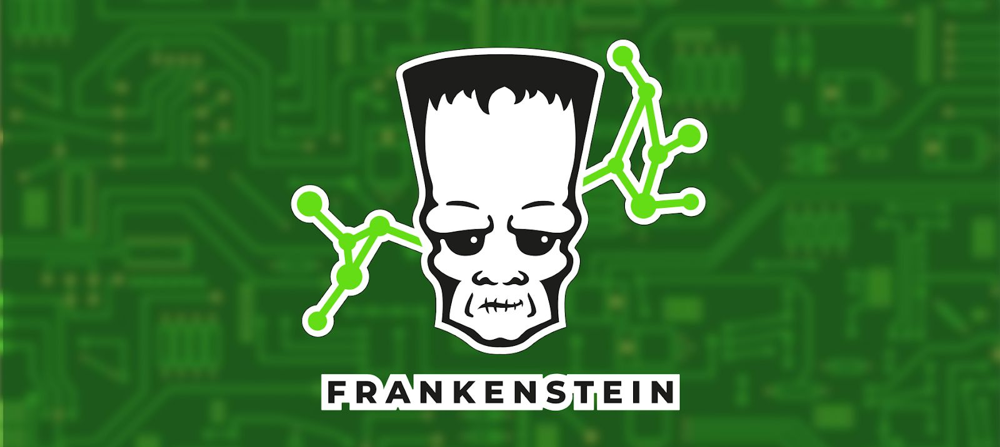
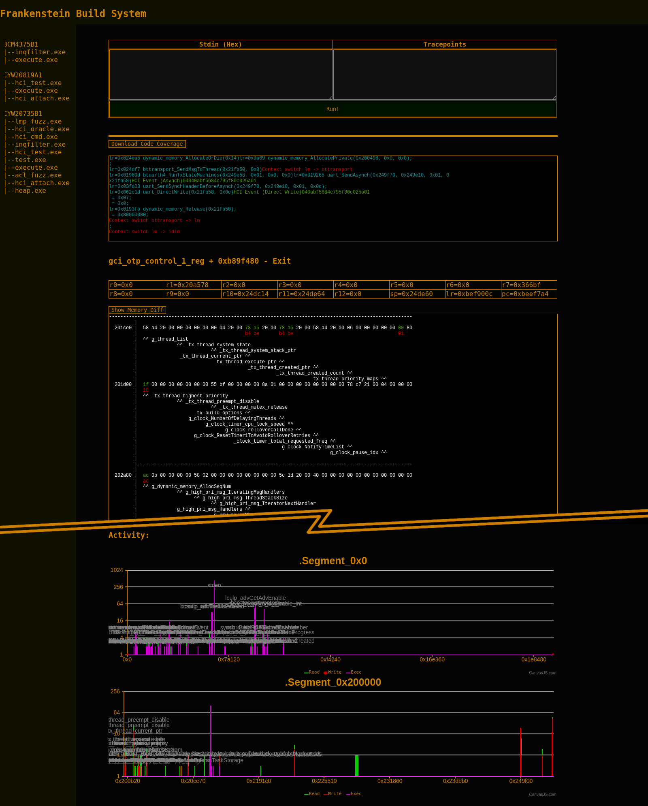

*Frankenstein* provides a virtual environment to fuzz wireless firmwares.
Firmwares can be hooked during runtime to extract their current state (i.e., `xmitstate` through *InternalBlue*).
Then, they can be re-executed in a virtual environment for fuzzing.
To do so, the firmware image needs to be reassembled to an ELF file that can be
executed with QEMU. The firmware image reassembly is simplified by a web-based UI.
 
*Frankenstein* is currently optimized for the *CYW20735* Bluetooth evaluation board. 
The slightly newer *CYW20819* Bluetooth evaluation board is already partially supported.
The port to the *CYW20819* evaluation board is required due to [CVE-2019-18614](doc/CVE_2019_18614.md), 
which prevents further fuzzing of connection states such as music streaming or tethering.
We are working on support for the *Samsung Galaxy S10/S20*—all of the European *S10e/S10/S10+/Note 10/S20* models
feature the same chip.
If you already have symbols for one chip but are missing symbols for a chip that had similar compiler options,
you might find using [Polypyus](https://github.com/seemoo-lab/polypyus) before running BinDiff helpful.

Table of Contents
------------
 *  Getting Started
    * [Basic Setup](#basic-setup)
    * [Attach Firmware to Host](#attaching-the-firmware-to-a-host)
    * [Reproducing CVEs](#reproducing-cves)
    * [Custom Firmware States](#dumping-custom-states)
    * [Heap Sanitizer](#live-heap-sanitizer)
    * [Dependencies](#important-notes--dependencies)
    * [Start Your New Project](doc/projects.md)

 *  Vulnerabilities
    * [ThreadX Heap Exploitation](doc/heap.md)
    * [EIR RCE Exploit (CVE-2019-11516)](doc/CVE_2019_11516.md)
    * [LE Heap Overflow  (CVE-2019-13916)](doc/CVE_2019_13916.md)
    * [Device to Host and Host to Device Buffer Misconfiguration (CVE-2019-18614)](doc/CVE_2019_18614.md)
    * [BlueFrag (CVE-2020-0022)](https://insinuator.net/2020/04/cve-2020-0022-an-android-8-0-9-0-bluetooth-zero-click-rce-bluefrag/) - Fixed in the Android February 2020 release. Look at our ACL [fuzzer](projects/CYW20735B1/patch/aclfuzz.c).

  * Miscellaneous
    * Master [Thesis](doc/Thesis.pdf) by Jan Ruge

Basic Setup
------------

This tool contains a web-based UI to configure the build.
This includes management of symbols and memory dumps.
The Makefile and linker scripts are generated automatically by the build system.
The build system can be launched by the following command and navigating the browser to [http://127.0.0.1:8000/](http://127.0.0.1:8000)

    python3 manage.py runserver

The build system already contains symbols and an initial memory dump. You can browse through the available projects
and the dump without having the actual hardware, *IDA Pro* or *Ghidra* database, etc. Symbols are truncated to the first 1k
symbols, so do not worry if something you know does not show up in the list immediately.

Each firmware version is located in a different project stored in `projects`.
A project contains the file `project.json`, which holds the symbol names and the memory layout including memory dumps.
The available symbols can be used to generate patches in C as well as for firmware emulation.
To build all patches and emulators for the *CYW20735* evaluation board run:

    make -C projects/CYW20735B1

In general, having the project built is sufficient to run emulation with QEMU. However, for fuzzing it can
be quite interesting to hold the firmware at a different state and continue fuzzing from there. So, if you currently
do not have any of our supported hardware, you can skip the `xmitstate` step later.

After rebuilding the project using `make -C projects/CYW20735B1`, the firmware state can be emulated, until the `Idle` thread is entered.
For this, execute:

    qemu-arm projects/CYW20735B1/gen/execute.exe

Or execute it from the web frontend and get even more insights:

Attaching the Firmware to a Host
---------------------------------

The basic `execute.exe` ELF file does not communicate to the outside world. Thus, it terminates in the
`Idle` thread. However, for fuzzing the firmware, it needs to be attached to a real host and obtain random
"wireless" inputs.

We provide an additional patch in `hci_attach.exe` that abstracts the calling conventions for the *Bluetooth Core Scheduler (BCS)*.
The BCS normally takes inputs from the hardware registers that contain decoded packets from the physical layer.
We replace the invocation of the interrupt handler `bluetoothCoreInt_C` that calls the BCS every 312.5µs (1/2 Bluetooth clock cycle).
This interrupt handler is now reading data from standard input (STDIN) of the *Linux* host.
You can feed arbitrary inputs, i.e., data from `/dev/urandom`.

    cat /dev/urandom | qemu-arm projects/CYW20735B1/gen/hci_attach.exe

Note that `hci_attach.exe` also calls the `btattach` command on the host, which is part of the *Linux Bluez* Bluetooth
stack. Once you run this file, your host will have a new Bluetooth device. You can list the current devices
with `hciconfig`. The hook to pass UART data from the emulated device to the *Linux* host is installed in the
firmware functions `uart_directWrite` and similar functions.

Depending on the host's exact behavior, you might need to reset the chip immediately after starting QEMU.
Otherwise, emulation will get stuck or segfault. On a current (September 2019) Debian testing, this is not
done automatically by the host and can be done manually as follows:

    hcitool -i hci1 cmd 0x03 0x03
        < HCI Command: ogf 0x03, ocf 0x0003, plen 0
        > HCI Event: 0x0e plen 4
          01 03 0C 00 

    
After successful reset, the emulation keeps running, which means that you will see a lot of output within
short time on the terminal that started the `hci_attach.exe`.
Now you can start actions on the host that cause interaction with the emulated Bluetooth firmware.
For example, you can scan for Bluetooth LE devices:

    hcitool -i hci1 lescan

If you open Wireshark while doing so, you will notice a lot of weird and invalid packets. Nonetheless,
the scanning output will show a lot of devices with random addresses within short time,
with some of these even returning mal-formatted names.

Reproducing CVEs
----------------

To trigger [CVE-2019-11516](doc/CVE_2019_11516.md), run `hcitool -i hci1 scan` and wait a couple of seconds to minutes.

    Context switch idle -> lm
    lr=0x02d12f lm_handleInqFHS(0x40)lr=0x02cc53 lc_handleInqResult(0x21fb1c)lr=0x041d91 inqfilter_isBdAddrRegistered(0x21fb24, 0x0);
    lr=0x041dc3 inqfilter_registerBdAddr(0x21fb24, 0x0);
    lr=0x041dfb bthci_event_SendInquiryResultEvent(0x21fb1c)lr=0x024e49 dynamic_memory_AllocateOrDie(0x19)Heap Corruption Detected
    pool = 0x20d368
    pool->size = 0x0180
    free_chunk = 0x221c04
    7f7fb0c9 | a3e4b4aa4242424242424242424242424242424242424242424242424242424242424242
        4242424242424242424242424242424242424242424242424242424242424242424242424242424
        2424242424242424242424242424242424242424242424242424242424242424242424242424242
        4242424242424242424242424242424242424242424242424242424242424242424242424242424
        2424242424242424242424242424242424242424242424242424242424242424242424242424242
        4242424242424242424242424242424242424242424242424242424242424242424242424242424
        2424242424242424242424242424242424242424242424242424242424242424242424242424242
        4242424242424242424242424242424242424242424242424242424242424242424242424242424
        2424242424242424242424242424242424242424242424242424242424242424242424242424242
        4242424242424242424242424242424242424242424242424242424242424242
    qemu: uncaught target signal 11 (Segmentation fault) - core dumped

For debugging purposes, our heap sanitizer is currently writing `0x42` to released memory.
 

Now let's trigger [CVE-2019-13916](doc/CVE_2019_13916.md). As this vulnerability is within parsing of BLE PDUs,
all you need to do is to successfully establish a connection to another LE device. If you
connect to random addresses, this will succeed at some point in time. Usually, this takes 
a couple of minutes and in some cases the emulator crashes instead and you need to restart
the emulation. Be patient!

    while true; do hcitool -i hci1 lecc ca:fe:ba:be:13:37; done
    
This results in:    

    lr=0x08ee3d bcsulp_getPktLength(0x854cfecd, 0x0) = 0xfe;
    lr=0x08ed33 bcsulp_getPktLength(0x05, 0x0) = 0x0;
    lr=0x08ec11 bcsulp_getPktLength(0x05, 0x0) = 0x0;
    lr=0x08ebc1 dhmulp_getTxBuffer(0x281704, 0x1b, 0x0148001b);
    lr=0x041e95 bcsulp_getPktLength(0x854cfecd, 0x0) = 0xfe;
    lr=0x08f115 bcsulp_procRxPayload(0x281618, 0x854cfecd)lr=0x08e9c3 bcsulp_getPktLength(0x854cfecd, 0x0) = 0xfe;
    lr=0x08ea2f bcsulp_getPktLength(0x854cfecd, 0x0) = 0xfe;
    lr=0x08ea4b utils_memcpy8(0x2232d0, 0x370c00, 0xfe)Heap Corruption Detected
    pool = 0x20d38c
    pool->block_start = 0x2232c0
    pool->capacity = 0x0f
    pool->size = 0x0108
    free_chunk = 0x1010a9a8

    qemu: uncaught target signal 11 (Segmentation fault) - core dumped

Dumping Custom States
---------------------

To dump a custom state, the most important patch is `patch/xmit_state.h`.
It generates re-executable firmware states.
It is used in a custom *InternalBlue* extension `internalBlueMod.py`.
If you are running on a native *Linux* and want to access the raw HCI device,
you need superuser rights.

    (sudo) python3 internalBlueMod.py

In this extension, we can run the following command to generate a re-executable state:

    > xmitstate target_function

Depending on the target function, this might crash sometimes. Just try again.
Once you successfully dumped a state, *InternalBlue* will finish with 

    [*] Received fuill firmware state
    
If the firmware crashes afterwards, you can ignore this.

Now, reload the web UI running on [http://127.0.0.1:8000/](http://127.0.0.1:8000/).
It will list your new dump in the *Segment Groups* view, i.e., `internalBlue_09.24.2019_18.32.09`.
The most recent dump will automatically be set to the *Active* state. You can now build the project
again.

If you were running *InternalBlue* with `sudo`, you might need to adjust access rights to the
generated state. To do so, run:

    sudo chown -R $USER:$USER projects/CYW20735B1/segment_groups/

Now, build the project again:

    make -C projects/CYW20735B1
    

Live Heap Sanitizer
-------------------

Run our customized *InternalBlue* script on real hardware:

    (sudo) python3 internalBlueMod.py
    
Load the heap sanitizer patch on top:

    > loadelf projects/CYW20735B1/gen/heap_sanitizer.patch
    
Now you will get detailed output about heap violations, i.e., caused by `memcpy` and the function
which called it. Depending on what you debug, you might need to adjust the definitions in `patch/heap_sanitizer.c`.

Important Notes & Dependencies
------------------------------

*Frankenstein* depends on *InternalBlue*. Projects must be named by the chip descriptions in the *InternalBlue*
firmware files. For example, `internalblue/fw/fw_0x4208.py` contains the firmware for the *CYW20735* evaluation
board and contains the identifier `FW_NAME = "CYW20735B1"`. Thus, the *Frankenstein* project name is `CYW20735B1`.

For QEMU, you need to install the `qemu-user` package.
Compilation of the project requires `gcc-arm-none-eabi`.

    apt install qemu-user gcc-arm-none-eabi gcc-multilib

Tested with `qemu-user (1:3.1+dfsg+8+deb10u2)` and `gcc-arm-none-eabi (15:7-2018-q2-6)` and `gcc-multilib (4:8.3.0-1)`. 

The following Python 3 packets are required:

    pip3 install django pyelftools==0.24
    
Tested with `django-1.11.24`.

We thank Anna Stichling for creating the *Frankenstein* logo.

