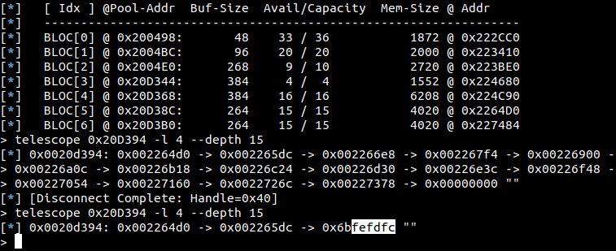

# Low Energy Reception Heap Overflow - CVE-2019-13916

## Disclosure Timeline
* Found by Jan and reported in July 2019.

## Bug
This section describes a Heap Based Buffer Overflow affecting the CYW20735, CYW20719, and CYW20819 Bluetooth development boards.
The Raspberry Pi 3 utilizing a BCM2835 is also vulnerable.
An overflow occurs in `bcsulp_procRxPayload` if an adversary sends a packet with a PDU longer than 252 bytes.

```c
char *bcsulp_rxBuffer; //located at 0x282880

void *mmulp_allocACLUp(int size) {
    ...
    //allocating 0x108 bytes
    char *ret = dynamic_memory_SpecialBlockPoolAllocateOrReturnNULL(g_mm_BLEDeviceToHostPool);

    //returning 0x100 bytes
    return ret + 8;
}

void *dhmulp_getRxBuffer(int a1) {
    ...
    //g_bt_config_BLE_Pools.size = 0x108, returns 0x100 bytes
    return mmulp_allocACLUp(g_bt_config_BLE_Pools.size);
}

void bcsulp_setupRxBuffer(int a1) {
    ...
    bcsulp_rxBuffer = dhmulp_getRxBuffer(a1);
    ...
}

void bcsulp_procRxPayload(int a1, int a2) {
    int length = bcsulp_getPktLength(a1); //can return up to 0xff

    //0xfc bytes left and causes heap overflow
    //utils_memcpy8() will always copy multiple of 4 bytes
    utils_memcpy8(bcsulp_rxBuffer + 4, rtx_rx_buffer, length); 
}
```


We can corrupt the next pointer of the free list.
The maximum PDU length is 255 bytes, therefore we only can overflow the address with 3 bytes of packet data.
The used `memcpy8` implementation always copies multiple of 4 bytes, so we can not make use of a partial overwrite.
The most significant byte seems to be random:



This value is not static and changes between connection attempts and even with every sent packet if the payload is randomized.
The payload is directly followed by the CRC.

```
                      2     1-255     3
+----------+-------+-----+---------+-----+
| Preamble | FEC 1 | HDR | Payload | CRC |
+----------+-------+-----+---------+-----+
                   |     PDU       |
                   +---------------+
   ```


We could show, that the seemingly uncontrolled byte is the first byte of that checksum.
It is computed over the PDU and the algorithm is initialized with a random value, that is communicated on connection setup.
The generation of the CRC is defined in Vol6 Part B 3.3.1 in the [standard](https://www.bluetooth.org/docman/handlers/downloaddoc.ashx?doc_id=457080).
The initial state is stored in the `wib_conn_lfsr` register.
We can compute the CRC that is transmitted over the air and therefore the fourth byte of the overflow.
By adapting the payload, we can control this byte and the `next` pointer in the free list.
To speed up the brute-force, we pre-compute the internal CRC state for the first 248 bytes of the PDU plus our constant header.
Therefore we only have to recompute the CRC for the last 7 Bytes for each attempt.
We modify the payload before it is copied to the Tx buffer prior `bcsulp_fillTxBuffer`.
We overwrite the PDU header `wib_tx_pyld_info` each time `bcsulp_progTxBuffer` is called.
Therefore we send our already prepared packet instead of, e.g., a `NULL` packet.
Even if we miss the first timeslot, the next transmission will corrupt the target successfully.
Due to time constraints of this thesis, we did not find a way to allocate three buffers and convert this flaw to a write-what-where gadget.

