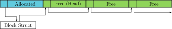
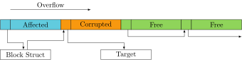
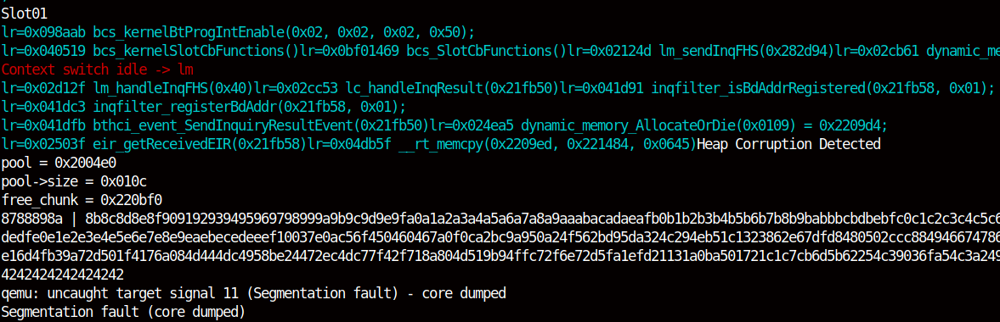

ThreadX has a custom heap implementation called Block Buffers.
As any heap implementation is prone to overflows, we further analyzed the possible exploit techniques.
We noticed, that heap corruptions will be undetected in some cases.
Therefore we decided to implement a heap sanitizer to detect overflows and some UAF conditions.
Some of the techniques described here were previously discovered by [those guys](https://web.archive.org/web/20190808113206/https://embedi.org/blog/remotely-compromise-devices-by-using-bugs-in-marvell-avastar-wi-fi-from-zero-knowledge-to-zero-click-rce/).


# Heap Operations
The Block buffer implementation manages multiple pools of different buffer sizes with static length.
This is different from a classic heap, where a continuous memory location is divided into smaller chunks of varying size.
Such an implementation is used on older Wi-Fi controllers utilizing the HNDRTE RTOS.
Each Block pool has a linked list of free buffers.
The first four bytes of the buffer holds a buffer header.
This header contains either a pointer to the next free buffer or a pointer to the Block pool if the buffer is allocated.
The initial state of the heap looks as follows:


As the application performs an allocation, the correct Block pool is found corresponding to the requested size.
The first buffer is taken from the free list and returned to the application.
The free list head now points to the second buffer in that list.
The resulting state is shown in the following.
Despite 6 years of development in between the Nexus 5 and CYW20735B-01, they both use ThreadX which handles Block buffer similar.




On the Nexus5 the `free` operation uses the Block pointer stored in the buffer header to insert the buffer in front of the free list.
On the CYW20735B-01, this process is slightly different and described below.
The `free` implementation of the Nexus 5 is shown in the following:

```c
void *dynamic_memory_AllocatePrivate(struct bloc *bloc) {
    buffer = bloc->free_list;
    bloc->free_list = *buffer;
    bloc->free_buffers --;

    *buffer = bloc;

    return buffer + 4;
}


void dynamic_memory_Release(int buffer) {
    bloc = *(buffer - 4)
    *(buffer-4) = bloc->free_list

    bloc->free_list = buffer - 4
    bloc->free_buffers ++;

    return;
}
```

In an overflow condition, one target would be to control the buffer header as this contains control data.
We distinguish between two cases, overflow of an allocated and free buffer.


# Overflow Free Buffer

Overflowing into a free Block buffer will corrupt a pointer in the free list.
As a result, an attacker might redirect a buffer allocation to an arbitrary address.
If the attacker can also control the buffer content, a write-what-where condition occurs.
In order to exploit this, an attacker needs to allocate multiple buffers in a row.
It has to be avoided those buffers to be freed immediately as those will be inserted as the head of this list.
We used this strategy for our exploit of CVE-2019-11516.
Immediately after the overflow the heap has the following structure.



As the firmware has not a lot of RAM available, allocated buffers are usually freed almost immediately.
Therefore, an attacker most often faces a situation, where the affected buffer was already freed.
The resulting heap structure looks as the following.
It can be seen, that in this situation, the third allocation will be an attacker-controlled location.


# Overflow Allocated Buffer

On the Nexus 5, the buffer header contains a pointer to the Block pool.
If an attacker can control this pointer it is possible to exploit the `free` process.
The attacker can write a pointer to the buffer to an arbitrary location.
It might be possible to add an element to a linked list such as timers and therefore gain code execution.
Note that this technique has side effects, as `bloc->free_buffers` will be incremented.
Also, there also exists a `bloc->thread_waiting_list` that must be `NULL`.
Otherwise, ThreadX will try to iterate over that list to find a thread waiting for a Block buffer.
This will cause a segmentation fault in most cases.

On the CYW20735B-01, this technique has been mitigated as shown in the following listing.
It is not sure if this is an intended security fix.
Instead of relying on the buffer header, the corresponding Block pool is searched manually and therefore the buffer header is ignored.
If no suitable Block pool is found, the firmware will crash gracefully with an assert.

```c
void dynamic_memory_Release(int buffer) {
    for (bloc = bloc_list; bloc; bloc = bloc->next)
        if (buffer >= bloc->memory &&
            buffer < bloc->memory + bloc->total_size)
                break;

    if (!bloc)
        dbfw_assert_fatal();

    *(buffer-4) = bloc->free_list;
    bloc->free_list = buffer - 4;
    bloc->free_buffers ++;

    return;
}
```


# Heap Sanitizer

Validating the heap integrity can reveal heap overflows.
As pointed out previously, a heap overflow might not even result in a crash.
Therefore we have added a heap sanitizer to the emulator and InternalBlue.
With the latter enabling us to detect live Heap corruptions on various platforms.

On InternalBlue we have to use the Read RAM command to read memory.
Therefore we have to read the heap structure in separate chunks.
As additional buffer operations might occur in the meantime, we can not rely on the integrity of the free list.
We noticed instead the buffer headers can only in one of the following states.

- A valid buffer pointer if the buffer is in the free list.
- NULL if the buffer is the last element in the free list.
- Pointer to the BLOC struct if the buffer is allocated.

The heap implementation of the eval board is slightly different than on earlier devices.
It is not sure if this is a change by Broadcom or ThreadX.
As mentioned they do not rely on the buffer header for allocated buffers anymore.
It is unclear, what the header is used for on that devices.

A heap sanitizer also has been added to the emulator, that is implemented in [dynamic_memory.h](projects/common/frankenstein/BCMBT/dynamic_memory.h).
By simply iterating over all free lists, we will notice, if a heap buffer was overflowed with random data.
We have also added additional checks to the buffer addresses as described in the suggested fixes.
We will also clear the content of free buffers with a fixed value.
Therefore it can be detected if data is written to an already freed buffer.
Such a condition is called UAF.
A read to a freed buffer will not be noiticed, so the detection of UAF vulnerabilities is limited.
This sanitizer was used to detect and locate CVE-2019-11516 and CVE-2019-13916.
A screenshot of this vulnerability detected by this sanitizer can be seen here:



# Suggested Fixes

Express Logic mentions in the documentation, that Block Overflows can cause "unpredictable behavior" and should be prevented.
Despite mistakes cannot be avoided and buffers are prone to overflows, we suggested some hardening fixes to the implementation.
They have the goal to prevent exploitation and supporting developers to detect overflows.
We communicated our suggestions to Express Logic, but they were not interested in implementing them.

On the stack, buffer overflows are detected by using cookies, a random value, that is not known by the attacker.
Those are placed at the end of each buffer or in the beginning of a stack frame.
If an overflow occurs, this value will change and the overflow is detected.
In order to exploit this, an attacker would require to leak memory in the first place.
As this method requires additional memory, it is not ideal for embedded devices, where memory is expensive.

For this particular implementation, we can add some constant time checks to detect heap corruptions.
To avoid exploitation, we must prevent `dynamic_memory_AllocatePrivate` to return an invalid address.
This can be achieved using two checks:
First, a block buffer must be in the valid range of the block.
This prevents arbitrary allocations and would catch an accidental overflow.
Second, the difference to the start of the Block must be a multiple of the Block size plus header.
This prevents an attacker to create overlapping buffers and also protects against partial overwrites of the block header.

```c
#define valid_block_ptr(pool, ptr)  \
    ((ptr >= pool->start & ptr < pool->start + pool->size) && \
    ((ptr - pool->start) % (pool->block_size + 4) == 0 ))

void *dynamic_memory_AllocatePrivate(struct block *pool) {
    if( ! valid_block_ptr( pool, bloc->free_list))
        raise_critical();
    ...
}
```

We can also check for each free operation if the header of the next physical buffer is still valid.
This check would trigger if the buffer to be freed caused an overflow.
A developer would get a notification if and which buffer is affected and speed up the development process.

```c
void *dynamic_memory_Release(void *ptr) {
    if (ptr - pool->start < pool->size) {
        int next_ptr = ptr + pool->block_size + 4;
        if (next_ptr && next_ptr != pool &&
            !valid_bloc_ptr(pool, next_ptr) )
                raise_critical();
    }
    ...
}
```

Even with this checks enabled, an attacker is still able to corrupt the free list.
A single block buffer can be inserted multiple times in the free list.
This will cause a buffer to be used in two different contexts and might cause problems.
To detect such a condition, we need to iterate over the full free list, which requires lots of resources.


